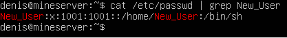
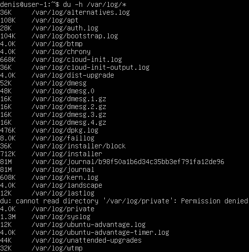

## Part 1. Установка ОС

### Часть 1: Установка операционной системы

-  На программу для виртуализации VirtualBox.

- С официального сайта Ubuntu https://releases.ubuntu.com/20.04/ необходимо загрузить образ  Ubuntu 20.04 Server LTS.

- Запустить VirtualBox и создать новую виртуальную машину. Необхлдимо указать тип ОС Lunux и версию "Ubuntu 64-разрядная".

- Задать установленное по умолчанию количество оперативной памяти и размер жесткого диска, а затем создать новый виртуальный диск.

- После ее создания перейдем в настройки и перейдем на вкладку "Система" и удостоверимся , что у процессора выбрано нужное количество ядер.

- Затем перейдем во вкладку "Хранилище" и выберем пустой empty контроллер IDE, нажав на иконку голубого диска с плюсом.

- В следующем меню выберем "Выбрать виртуальный оптический диск" и укажем путь к образу Ubuntu 20.04 Server LTS.

- Теперь можно запустить виртуальную машину, нажав кнопку старт.

- В дальнейшем в новом окне нам надо будет указать язык и после этого выбрать "Install Ubuntu Server" и снова нажмем "Enter".

- В процессе установки указываем все необходимые нам настройки: язык, местоположение.

- Далле будет необходимо указать имя пользователя, юзера, сервера и задать пароль.

- Также нам будет предложено выбрать дополнительные настройки. Так как мы хотим установить сервер без графического интерфейса, выбираем только опцию "OpenSSH server".

- А после установки перезагружаем виртуальную машину.

### Часть 2: Узнать установленную версию Ubuntu

Для того чтобы узнать установленную версию Ubuntu, выполним следующую команду в терминале:

```bash
cat /etc/issue
```


___
## Part 2: Создание пользователя

### Часть 1: Создание пользователя

- Для создания нового пользователя и добавлением его в группу adm выполним нижеприведенную команду.
```bash
sudo useradd -G adm Ivan
```
- Новый пользователь создан.


### Часть 2: Проверка добавления в группу adm 

- Для проверки, что новый пользователь добавлен в группу "adm" выполним команду cat /etc/passwd.
```bash
cat /etc/passwd | grep New_User
```
- В выводе команды мы увидим информацию о новом пользователе.


___
## Part 3. Настройка сети ОС

### Часть 1: Указание название машины и установка временной зоны 

- Для задания названия машины "user-1" введем команду:

```bash
sudo hostnamectl set-hostname margolis-1
```


- Выполняем перезагрузку для обновления машины командой reboot

```bash
reboot
```


- Чтобы установить временную зону выполним следующую команду:

```bash
sudo timedatectl set-timezone "Asia/Yekaterinburg"
```


### Часть 2: Вывод названий сетевых интерфейсов

- Для вывода сетевых интерфейсов воспользуемся командой:

```bash
ip link show
```
 

* lo (loopback device) – виртуальный интерфейс, присутствующий по умолчанию в любом Linux. Он используется для отладки сетевых программ и запуска серверных приложений на локальной машине. С этим интерфейсом всегда связан адрес 127.0.0.1. У него есть dns-имя – localhost. Посмотреть привязку можно в файле /etc/hosts.

### Часть 3: Получение IP-адреса от DHCP сервера

- Для получения IP-адреса устройства от DHCP сервера, воспользуемся командой:

```bash
ip a
```


### Расшифровка DHCP
* DHCP (англ. Dynamic Host Configuration Protocol — протокол динамической настройки узла) — сетевой протокол, позволяющий сетевым устройствам автоматически получать IP-адрес и другие параметры, необходимые для работы в сети TCP/IP. Данный протокол работает по модели «клиент-сервер». Для автоматической конфигурации компьютер-клиент на этапе конфигурации сетевого устройства обращается к так называемому серверу DHCP и получает от него нужные параметры.

### Часть 4: Определение внешнего и внутреннего IP-адреса шлюза

1. Для определения внешнего IP-адреса шлюза, исполним команду:

```bash
curl ifconfig.me
```


2. Для определения внутреннего IP-адреса шлюза, выполним команду:

```bash
ip route | grep default
```


### Часть 5: Задание статичных сетевых настроек

1. Для задания статичных IP-адреса, шлюза и DNS серверов, редактируем файл /etc/netplan/00-installer-config.yaml.

```bash
sudo vim /etc/netplan/00-installer-config.yaml
```


2. Перезагрузка виртуальной машины

- После введения статичных сетевых настроек, перезагрузим машину командой reboot.

3. Проверяем командой 'ping'


___

___

___
## Part 4. Обновление ОС

### Часть 1: Обновление системных пакетов

- Для обновления системных пакетов, выполним следующую команду:

```bash
sudo apt update && sudo apt upgrade
```

___
## Part 5. Использование команды sudo

### Часть 1: Разрешение использования команды sudo

1. Для разрешения пользователю, созданному в Part 2, выполнять команды с правами суперпользователя, добавим его в группу sudo.

```bash
sudo usermod -aG sudo New_User
```
* Истинное назначение команды sudo
Команда sudo (от английского "superuser do") предоставляет возможность выполнения команд с правами суперпользователя (root) или другого пользователя с правами администратора. В Linux безопасность очень важна, и команда sudo помогает предотвратить случайные или нежелательные действия с правами администратора. Вместо постоянного входа под пользователем с полными правами, вы можете временно повышать привилегии при необходимости, указав перед командой sudo. При этом система запросит ваш пароль для подтверждения вашей личности.

### Часть 2: Изменение hostname с помощью sudo

1. Для изменения hostname от имени пользователя выполним команду:

```bash
sudo su
hostname s21-Ubuntu
```

___
## Part 6. Установка и настройка службы времени

### Часть 1: Установка и настройка службы автоматической синхронизации времени

- Для установки службы автоматической синхронизации времени, выполним следующую команду:

```bash
sudo apt install chrony
```
- После установки Chrony, служба автоматической синхронизации времени будет автоматически запущена и настроена для синхронизации времени с серверами времени в сети.

### Часть 2: Вывод времени и часового пояса

- Для вывода текущего времени и часового пояса, введем такую команду:

```bash
date
```


- Для вывода информации о системном времени, включая состояние синхронизации с NTP-серверами, выполним команду:

```bash
timedatectl show
```


___
## Part 7. Установка и использование текстовых редакторов

### Часть 1: Установка текстовых редакторов

- Для выполнения установим текстовые редакторы VIM, NANO и MCEDIT с помощью следующей команды:

```bash
sudo apt install vim nano mc
```
### Часть 2: Создание файлов test_X.txt и написание никнейма

1. Создадим файлы test_VIM.txt, test_NANO.txt и test_MCEDIT.txt с помощью соответствующих редакторов и напишем в каждом из них свой никнейм.

* **VIM** Для сохранения и выхода нажал ESC и прописал :wq и имя файла.


* **NANO** Для сохранения нажал "ctrl + o", ввёл имя файла и подтвердил. Вышел через "ctrl + x".


* **MCEDIT** Для сохранения нажал f2, затем подтвердил и после нажал f10 для выхода.


#### Описание выхода с сохранением изменений
 Для сохранения изменений и выхода из редакторов:

* В VIM: Вводим команду :wq и нажимаем Enter.
* В NANO: Используем комбинацию клавиш Ctrl + O для сохранения и Ctrl + X для выхода.
* В MCEDIT: Нажимаем F2 для сохранения и F10 для выхода.

### Часть 3: Редактирование файла и замена никнейма

 Откроем каждый файл на редактирование в соответствующих редакторах и заменим свой никнейм на строку "21 School 21".

* **VIM** Для выхода без сохранения ESC -> :q! -> ENTER


* **NANO** Для выхода без сохранения ctrl + x -> N


* **MCEDIT** Для выхода без сохранения f10 и выберите No.


#### Описание выхода без сохранения изменений
 Для выхода без сохранения изменений из редакторов:

* В VIM: Вводим команду :q! и нажимаем Enter.
* В NANO: Используем комбинацию клавиш Ctrl + X, затем выбираем "No" и нажимаем Enter.
* В MCEDIT: Нажимаем F10 и выбираем Np.

### Часть 4: Поиск и замена слов в каждом редакторе

-  Отредактируем каждый файл еще раз и заменим слово "School" на "University" с помощью поиска и замены.

#### В VIM:

- Откройте файл test_VIM.txt в редакторе VIM:

```bash
vim vim.txt
```

- Нажмите клавишу Esc.
- Введите следующую команду для поиска слова "School":

```bash
/right_word
```
- Найденное слово будет выделено. Если нужное слово найдено, продолжайте дальше. Если необходимо перейти к следующему вхождению, используйте клавишу n.


- Для замены слова введите следующую команду:

```bash
:%s/rigth_word/new_word/g
```

- Нажмите клавишу Enter для выполнения замены.


- Для сохранения изменений и выхода из редактора, введите команду:

```bash
:wq
```

#### В NANO:

- Откройте файл test_NANO.txt в редакторе NANO:

```bash
nano nano.txt
```

- Используйте комбинацию клавиш Ctrl + W для поиска нужного слова.

- Если нужное слово найдено, продолжайте дальше. Если необходимо перейти к следующему вхождению, используйте комбинацию клавиш Ctrl + W повторно.


- Для замены слова используйте комбинацию клавиш Ctrl + левый слэш.

- Введите новое выражение и нажмите клавишу Enter для выполнения замены.


- Для выхода без сохранения изменений, используйте комбинацию клавиш Ctrl + X, выберите "No" и нажмите Enter.

#### В MCEDIT:

- Откройте файл test_MCEDIT.txt в редакторе MCEDIT:

```bash
mcedit mcedit.txt
```
- Нажмите клавишу F7 для перехода в режим поиска.

- Введите слово для поиска. Найденное слово будет подсвечено. Если нужное слово найдено, продолжайте дальше. Если необходимо перейти к следующему вхождению, используйте клавишу F7 повторно.


- Для замены слова нажмите клавишу F4 для открытия меню.

- Выберите "Replace" (Замена) и введите нужное в поле "Find" (Найти) и новое слово в поле "Replace".


- Нажмите клавишу Enter для выполнения замены.

- Для выхода без сохранения изменений, нажмите F10.
___

## Part 8. Установка и базовая настройка сервиса SSHD

### Часть 1: Установка и настройка службы SSHD

- Установим службу SSHD с помощью команды:
```bash
sudo apt install openssh-server
```
- Добавим автостарт службы SSHD при загрузке системы:
```bash
sudo systemctl enable ssh
```
- Перенастроим службу SSHD на порт 2022. Для этого откроем файл конфигурации SSHD:
```bash
sudo nano /etc/ssh/sshd_config
```


- В файле найдем строку с портом  22 и заменим значение порта на 2022. Уберем комментирующую решетку слева от порта. Сохраним изменения и закроем файл.

- Проверим наличие процесса sshd с помощью команды ps и подберем ключи для вывода нужной информации:
```bash
ps -aux | grep sshd
```


#### Объяснение значения команды и каждого ключа в ней:

* ps: Команда выводит информацию о процессах.
* -aux: Ключи для вывода всех процессов пользователя, включая процессы других пользователей и системные процессы.
* |: Конвейерная команда для передачи вывода команды ps -aux на вход команде grep.
* grep sshd: Команда для поиска процессов, связанных с sshd.

### Часть 2: Перезагрузка системы

- Для перезагрузки системы выполним следующую команду:
```bash
sudo reboot
```
### Часть 3: Вывод команды netstat -tan

- Чтобы вывести состояния соединений нужно установить утилиту netstat(если она не установлена) командой:

```bash
sudo apt install net-tools
```

- Теперь, чтобы убедиться, что служба слушает на порту 2022,  выполним команду:

```bash
netstat -tan
```


#### Объяснение значения ключей -tan и каждого столбца вывода:
* netstat: Команда для вывода сетевой статистики, включая информацию о сетевых соединениях и портах.
* -t: Флаг для вывода только TCP-соединений.
* -a: Флаг для вывода всех сетевых соединений и портов, включая слушающие.
* -n: Флаг для вывода числовых значений портов вместо их имён.

* Значения столбцов вывода:

* tcp: Протокол TCP.
* 0 0 0.0.0.0:2022: Локальный адрес 0.0.0.0 и порт 2022, что означает, что служба слушает на всех доступных IP-адресах на порту 2022.
* 0.0.0.0:*: Внешний адрес 0.0.0.0 и звёздочка вместо порта, что означает, что служба слушает на всех доступных IP-адресах на любом порту.
* LISTEN: Состояние прослушивания, что означает, что служба активно слушает на этом порту и готова принимать соединения.
___
## Part 9. Установка и использование утилит top, htop

### Часть 1: Установка и запуск утилит top и htop

- Установим утилиты top и htop с помощью следующих команд:
```bash
sudo apt install top htop
```
- Запустим утилиту top


### Часть 2: Вывод команды top
* По выводу команды top определим следующую информацию:

* uptime: Время работы системы - 18 min.
* Количество авторизованных пользователей - 1 user.
* Общую загрузку системы - load average 0,00, 0,00, 0,00.
* Общее количество процессов - tasks 96 total, 1 running, 95 slepping, 0 stopped, 0 zombie
* Загрузку CPU - 0,0 us, 0,0 sy, 0,0 ni,100,0 id 0,0 wa, 0,0 hi, 0,0 si 0,0 st.
* Загрузку памяти Mib mem - 964.9 total,  422.7 free, 145.1 used, 397.1 buff/cache  .
* PID процесса, занимающего больше всего памяти - PID 1.
* PID процесса, занимающего больше всего процессорного времени - PID 1.

### Часть 3: Вывод команды htop

- Вывод сортированный по PID


- Вывод сортированный по PERCENT_CPU


- Вывод сортированный по PERCENT_MEM


- Вывод сортированный по TIME


- Вывод сортированный по SSHD


- Вывод сортированный по syslog


- Вывод поиск по syslog


- C добавленным выводом hostname, clock и uptime


___

## Part 10. Использование утилиты fdisk

1. Запустите команду fdisk -l для получения информации о жестких дисках:

```bash
sudo fdisk -l
```

### Disk /dev/mapepr/ubuntu--vg--ubuntu--lv, size: 8.25 GiB, 8854175744 bytes, 17293312 sectors
___
## Part 11. Использование утилиты df

- Запустите команду df, введите в терминале следующую команду:

```bash
df /
```


* Размер раздела : 8408452
* Размер занятого пространства : 4265140
* Размер свободного пространства : 3694596
* Процент использования : 54%
* Тип - байты.

- Запустите команду df -Th для получения информации о дисковом пространстве с выводом типов файловых систем:

```bash
df -Th /
```


* Размер раздела : 8.1G
* Размер занятого пространства : 4.1G
* Размер свободного пространства : 3.6G
* Процент использования : 54%
* Type - ext4
___
## Part 12. Использование утилиты du

### Запуск команды du

- Запустите команду du для получения информации о размере папок:

```bash
du
```


- Запустите команду du для получения информации о размере папок:

```bash
du /home
```


- Запустите команду du для получения информации о размере папок:

```bash
du /var
```


- Запустите команду du для получения информации о размере папок:

```bash
du /var/log
```


- Вывод команды du человекочитаемом виде:

```bash
du -h
```


- Вывод размера папки /home в человекочитаемом виде:

```bash
du -h /home
```
___


- Вывод размера папки /var в человекочитаемом виде:

```bash
du -h /var
```
___


- Вывод размера папки /var/log в человекочитаемом виде:

```bash
du -h /var/log
```
___


- Выведите размер всего содержимого в папке /var/log с помощью звездочки (*):

```bash
du -h /var/log/*
```

___
## Part 13. Установка и использование утилиты ncdu

### Установка утилиты ncdu

- Установите утилиту ncdu с помощью команды:

```bash
sudo apt install ncdu
```


- Запустите утилиту ncdu для вывода размеров папки /home:

```bash
ncdu /home
```


- Запустите утилиту ncdu для вывода размеров папки /var:

```bash
ncdu /var
```


- Запустите утилиту ncdu для вывода размеров папки /var/log:

```bash
ncdu /var/log
```


___

## Part 14. Работа с системными журналами

- Для просмотра системного журнала dmesg, выполните команду:

```bash
cat /var/log/dmesg
```
- Для просмотра системного журнала syslog, выполните команду:

```bash
cat /var/log/syslog
```

- Для просмотра системного журнала auth.log, выполните команду:

```bash
cat /var/log/auth.log
```

- Поиск времени последней успешной авторизации


- Перезапустите службу SSHd с помощью следующей команды:

```bash
sudo systemctl restart sshd
```

___
## Part 15. Использование планировщика заданий CRON

- Откройте файл cron для редактирования:

```bash
crontab -e
```

2. Добавьте строку, которая будет запускать команду uptime каждые 2 минуты. Для этого нужно ввести:

```vim
*/2 * * * * uptime
```


3. Сохраните файл и закройте его.

4. Дождитесь, пока задание будет запущено несколько раз (как минимум два раза, чтобы получить две строчки о выполнении).


5. Чтобы просмотреть список текущих заданий для CRON, выполните команду:

```bash
crontab -l
```


6. Удалите все задания из планировщика заданий CRON. Для этого введите:

```bash
crontab -r
```

___

